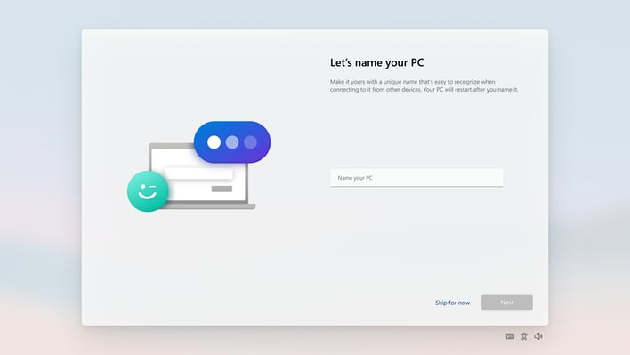
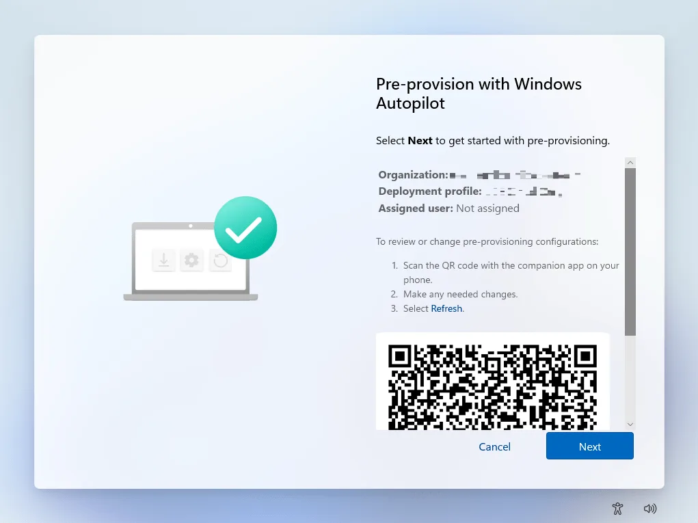

# Windows 11 Hybrid Azure AD Join + Intune Enrollment Guide

---

## Table of Contents

- [Windows 11 Hybrid Azure AD Join + Intune Enrollment Guide](#windows-11-hybrid-azure-ad-join--intune-enrollment-guide)
  - [Table of Contents](#table-of-contents)
  - [Clean Install Windows 11](#clean-install-windows-11)
  - [(Optional) Windows Autopilot Pre-Provision (White Glove)](#optional-windows-autopilot-pre-provision-white-glove)
    - [Completion](#completion)

---

## Clean Install Windows 11

Boot from the Windows 11 USB. Follow the language/region prompts.

When you reach the partition selection screen:

1. Select each existing OS / data partition and click **Delete** until only **Unallocated space** remains.
2. DO NOT delete:
   - Your USB installation media
   - OEM recovery partitions (if you intentionally want to keep them)
3. You should end with one line: **Drive 0 Unallocated Space**.

Select the unallocated space and click **Next**.

Windows will now copy files, install features, and reboot several times. No action needed until the Out-of-Box Experience (OOBE) reappears.

---

## (Optional) Windows Autopilot Pre-Provision (White Glove)

After the device has rebooted several times and OOBE starts again:

1. Choose/confirm your preferred **language** and **keyboard layout(s)**.
2. When you reach the screen **"Let's name your device"**, click **Skip for now**.

3. Continue until you see **"Set up for work or school"** (wording can vary slightly such as _Configure for work/school or private account_).
4. Press the **Windows key 5 times** in quick succession. This launches the **Pre-provisioning (Autopilot) environment**.

5. Select **"Pre-provision with Windows Autopilot"**.
6. Click **Next** to start the pre-provision workflow.

### Completion

When the process reports **Success**, click **Reseal**. The device reboots back to the ready state and is now prepared for handoff to the end user (user phase sign-in will be faster because core provisioning already ran).

> [!NOTE] If failure occurs, photograph/log the error details before exiting. > Common causes: missing assignment, network restrictions, or required app > > install failure.

---
