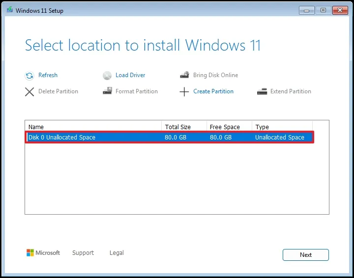
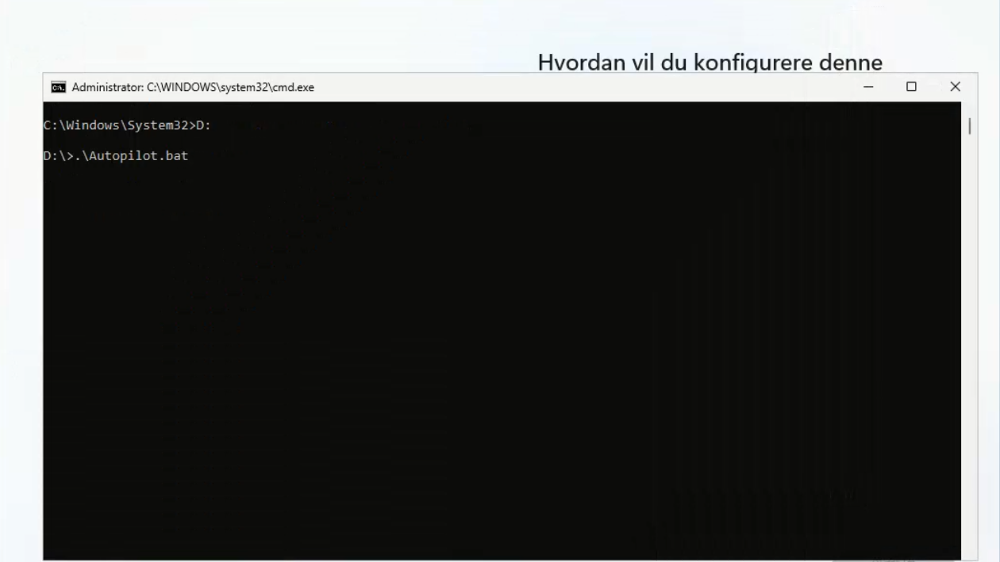

# Windows 11 Hybrid Azure AD Join + Intune Enrollment Guide


## Preparation of Autopilot.bat

Please follow the instructions from [here](https://github.com/Palmegg/M365/tree/main/Various_Scripts/Autopilot) to prepare your *Autopilot.bat*

## Clean Install Windows 11

Boot from the Windows 11 USB. Follow the language/region prompts.


When you reach the partition selection screen:

1. Select each existing OS / data partition and click **Delete** until only **Unallocated space** remains.
2. DO NOT delete:
   - Your USB installation media
   - OEM recovery partitions (if you intentionally want to keep them)
3. You should end with one line: **Drive 0 Unallocated Space**.


Select the unallocated space and click **Next**.



Windows will now copy files, install features, and reboot several times. No action needed until the Out-of-Box Experience (OOBE) reappears.

## Autopilot enrollment via .bat file

Once you reach **"Configure for work or school"** press shift + F10 to open a command prompt window

> [!IMPORTANT]
> __*In some cases it will be necessary to press shift + fn + F10*__

Now type the following to change your working directory to your USB Drive where Autopilot.bat is located. 

```
D:
```
Now run the batch file with:

```
.\Autopilot.bat
```


Once the script has imported the device to the specific tenant, please restart the computer using the following command

```
Restart-Computer
```

## Windows Autopilot Pre-Provision

After the device has rebooted several times and OOBE starts again:

1. Choose/confirm your preferred **language** and **keyboard layout(s)**.
2. When you reach the screen **"Let's name your device"**, click **Skip for now**.


1. Continue until you see **"Set up for work or school"**
2. Press the **Windows key 5 times** in quick succession. This launches the **Pre-provisioning (Autopilot) environment**.


5. Select **"Pre-provision with Windows Autopilot"**.
6. Click **Next** to start the pre-provision workflow.


### Completion

When the process reports **Success**, click **Reseal**. The device reboots back to the ready state and is now ready to be signed into with the users credentials.

---
